

  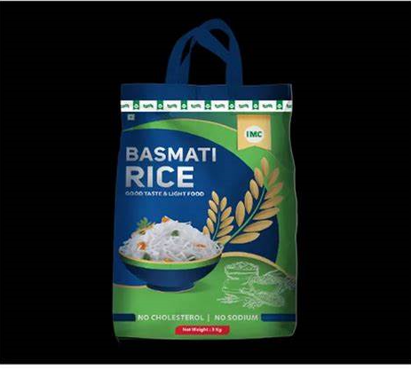

# OPERATION MARKET STORM: DATA-DRIVEN STRATEGY FOR RIZOSTAR'S WEST AFRICAN LAUNCH

**Role:** Data Strategist  
**Client:** AfriFoods Ltd  
**Timeline:** May 2025  
**Tools:** Python, Pandas, Seaborn, Matplotlib, Scikit-learn  
**Dataset:** jollofwars_ricesales_dataset

## Introduction

Breaking into a saturated market is never easy—especially with fragmented data. AfriFoods Ltd. plans to launch RizoStar, a premium rice brand, in Ghana and Nigeria by June 2025. This project transforms messy market data into sharp, strategic insights to guide a confident market entry.

## Problem Statement

AfriFoods faces four key challenges:  
- Poor data quality  
- Dominant competitors (Caprice, Golden Harvest, Uncle Sam)  
- Limited customer insight  
- A fast-approaching launch deadline  

**The core question:** How can AfriFoods leverage limited and inconsistent data to choose the right city, price point, grain type, and timing for RizoStar’s launch?

## Objectives

- Evaluate brand performance and customer preferences by location  
- Analyze pricing tiers, satisfaction trends, and seasonality  
- Identify underserved market segments for premium positioning  
- Generate actionable, data-backed launch recommendations

## Methodology

1. Data Collection & Cleaning  
2. Exploratory Data Analysis (EDA)  
3. Customer Segmentation & Competitor Analysis  
4. Predictive Revenue Modeling  
5. Insight Synthesis  
6. Strategic Roadmap Formulation  

## Key Insights & Visual Summaries

### 1. Brand Dominance by City  
*Caprice leads in Accra and Kumasi, Golden Harvest in Abuja, Uncle Sam in Lagos.*

  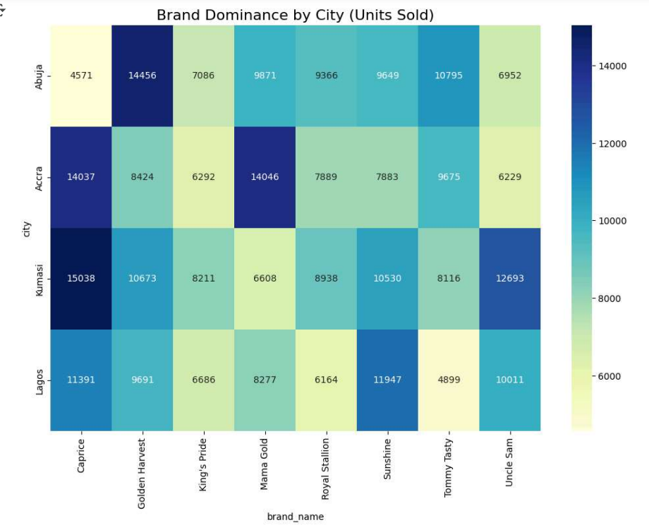

**Takeaway:** Tailor marketing by city. Strengthen presence where competitors are weak.

### 2. RizoStar’s Predicted Monthly Revenue  
*Abuja projected at ₦13.4M, followed by Kumasi and Accra.*

  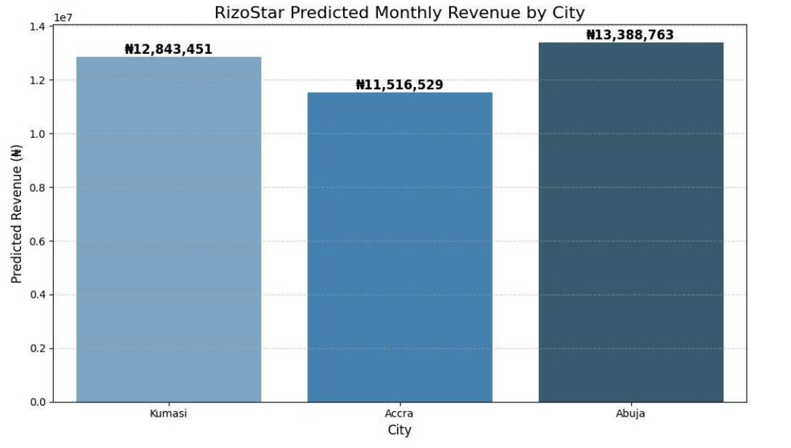

**Takeaway:** Launch in Abuja first, then scale to Kumasi and Accra with localized campaigns.

---

### 3. Weighted Customer Ratings by Brand  
*Caprice and King's Pride lead; Sunshine and Royal Stallion underperform.*

  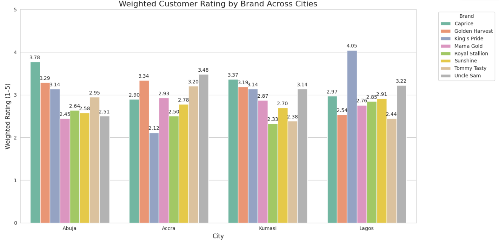

**Takeaway:** Benchmark RizoStar’s quality against top performers.

---

### 4. Customer Satisfaction by Grain Type  
*Basmati (3.02) > Long Grain (2.99) > Local (2.83)*

  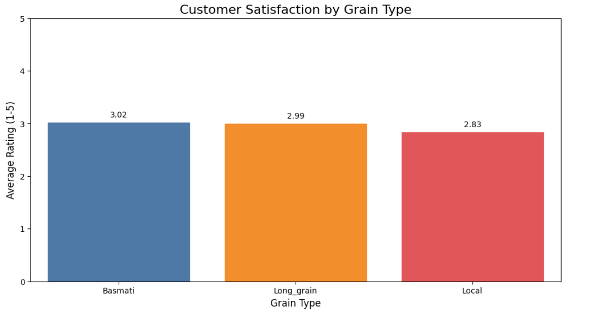

**Takeaway:** Lead with Basmati as premium; elevate Local grain branding.

---

### 5. Reviews vs Units Sold  
*Some products sell well despite few reviews.*

  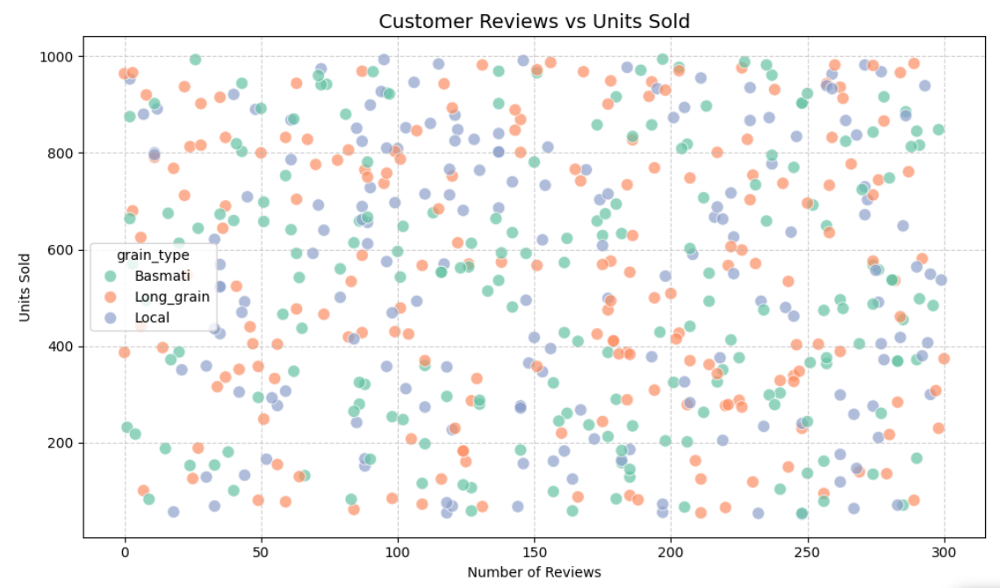

**Takeaway:** Encourage post-purchase reviews. Monitor low-review high-sales products for transparency.

---

### 6. Market Price Tiers  
*No premium-tier products. Market is 57% medium, 43% low price.*

  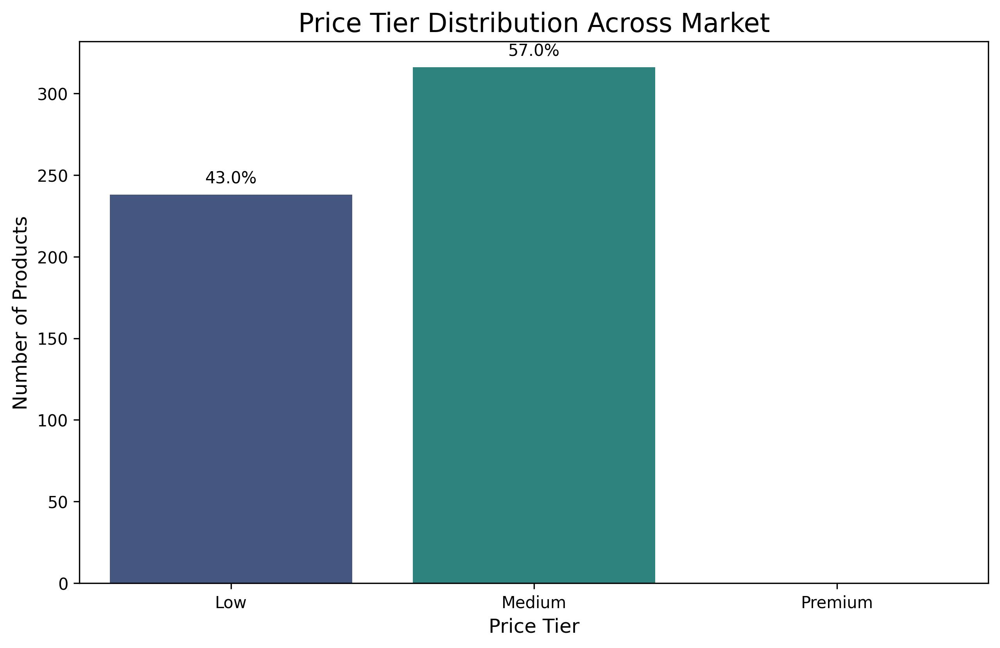

**Takeaway:** Position RizoStar to fill the premium gap with value-driven messaging.

### 7. High Sales, Low Reviews  
*Brands like Sunshine and King’s Pride perform offline but lack digital presence.*

  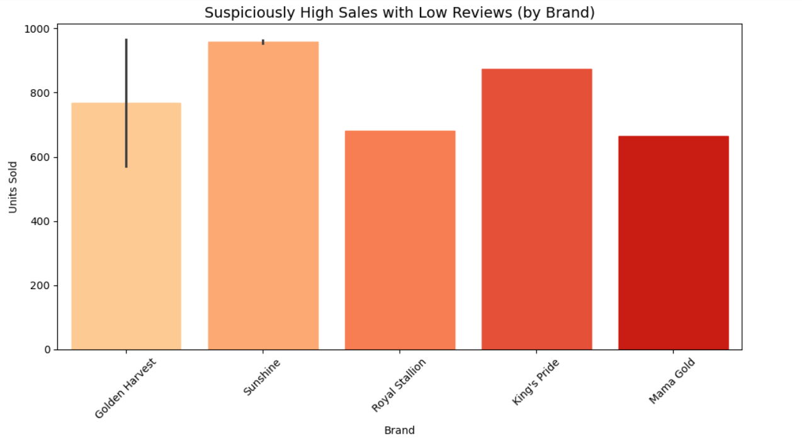

**Takeaway:** Build online trust through feedback and review strategies.

### 8. Total Revenue by City  
*Kumasi tops revenue, followed by Accra and Abuja.*

  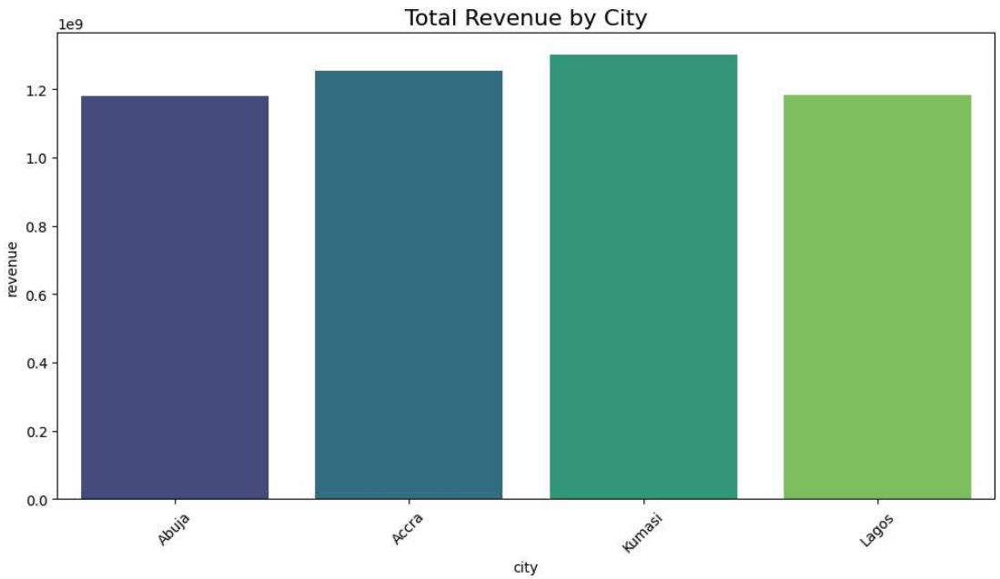

**Takeaway:** Explore a multi-city launch strategy with adaptive pricing.

### 9. Monthly Sales Trends  
*Peaks observed in February, March, October, and December.*

  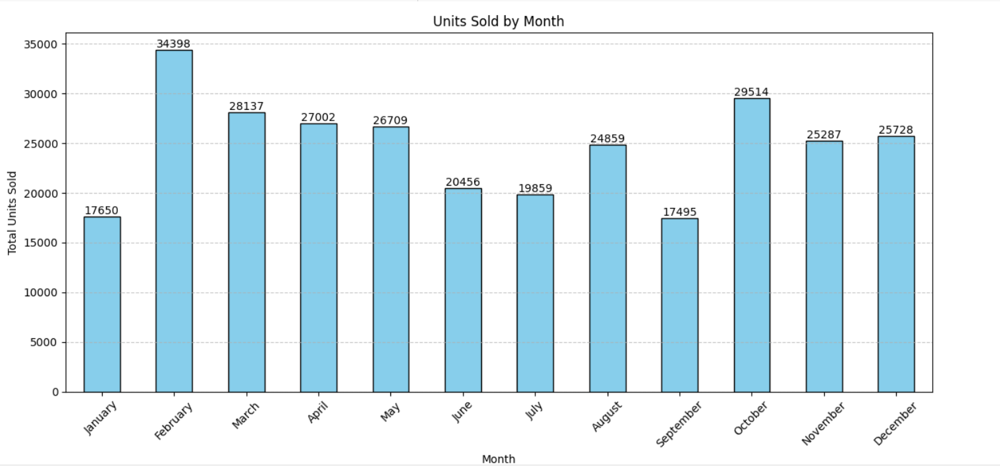

**Takeaway:** Align marketing with peak demand cycles.

### 10. Suspicious Sales Anomalies  
*High sales but near-zero reviews.*

  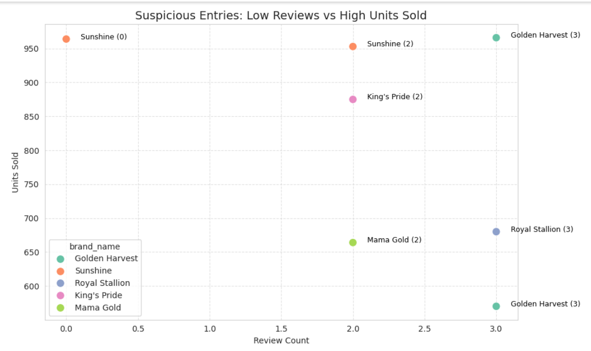

**Takeaway:** Audit product authenticity and encourage digital engagement.

## Hypothesis Testing

- **Correlation between reviews and sales:** -0.036  
- **P-value:** 0.401 (Not statistically significant)

**Conclusion:** Sales volume and digital review counts are not strongly linked.

## Revenue Forecast Model

- **Model:** Random Forest Regressor  
- **R² Score:** 0.995  
- **RMSE:** ₦408,021  
- **MAE:** ₦297,061  

**Insight:** Model effectively predicts monthly revenue to guide location-based strategy.

## Strategic Roadmap

- **Phase 1:** Launch in Abuja (₦18,000 pricing) with premium positioning  
- **Phase 2:** Expand to Kumasi and Accra with city-specific campaigns  
- **Ongoing:**  
  - Monitor pricing trends  
  - Use AI for review filtering  
  - Run trust-building initiatives

## Tagline

> **"RizoStar: Premium quality trusted by 3,000+ customers. Priced smartly. Powered by data. Tailored for West Africa."**

## Conclusion

Despite limited and messy data, this project delivers a clear, evidence-based strategy for launching RizoStar. By combining predictive modeling with targeted insights, AfriFoods is now equipped to make smarter decisions, maximize returns, and win market share across West Africa.

